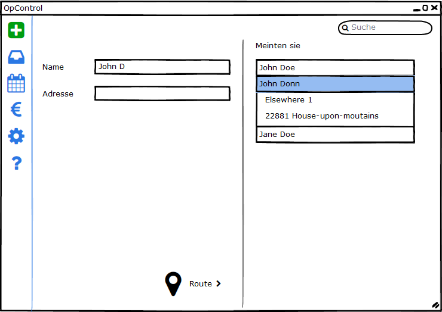
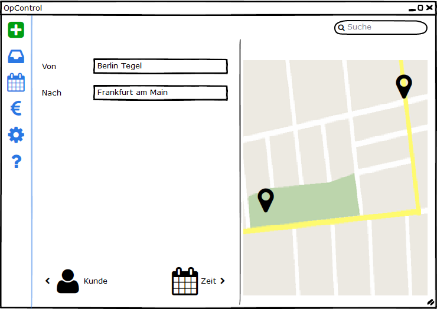
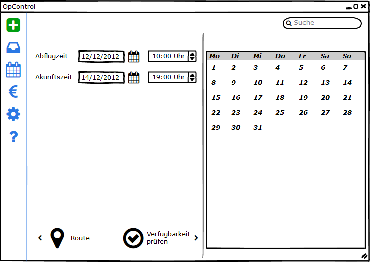
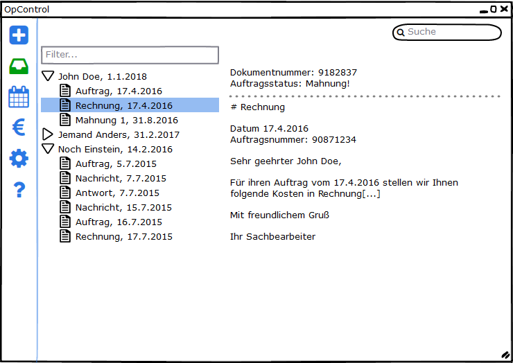
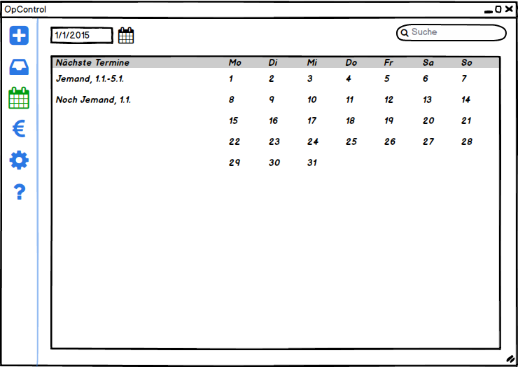
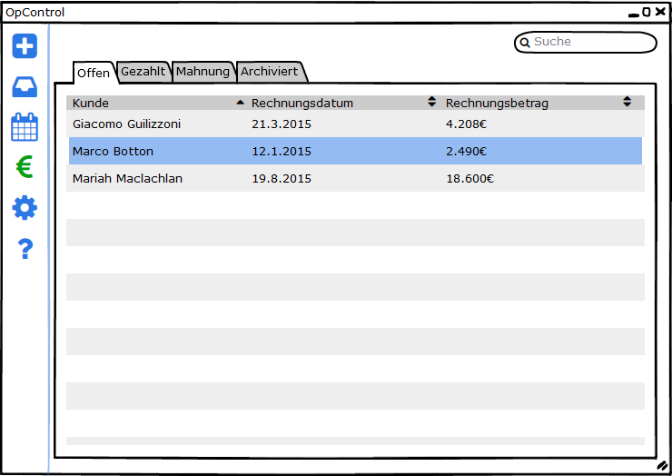
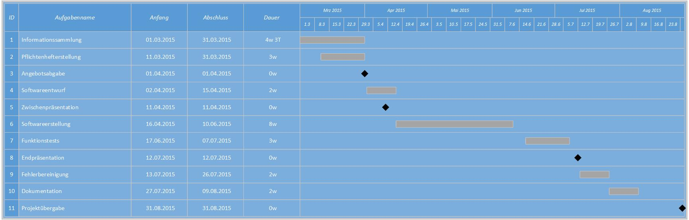

# 1. Zielbestimmung

Das zu entwickelnde Projekt soll der HINOTORI Executive die rechnergestützte Abarbeitung bei der Vercharterung von Geschäftsreiseflugzeugen ermöglichen.
Der HINOTORI Executive soll ein "Werkzeug" zur Verfügung gestellt werden, mit dem die unterschiedlichen Status von der Aufnahme von Anfragen, das Versenden von Angeboten, Verträgen und Rechnung sowie ein intergriertes Mahnwesen abgebildet werden können.

Die Software soll durch automatische Verfügbarkeitsprüfungen die Abarbeitung erleichtern und Doppelbuchungen verhindern.

## 1.1.  Musskriterien

- Der Kunde kann Charteranfragen erfassen, Angebote erstellen und nach Flugdurchführung entsprechende Rechnungen an den Kunden versenden. Dabei wird es dem Kunden zu jederzeit möglich sein Änderungen in den Daten vorzunehmen.
- Die Aufnahme einer Charteranfrage erfolgt in der Regel telefonisch. Hierbei sind mindestens folgende Daten zu erfassen:
 - Name und Kontaktdaten des Kunden
 - für Charteroption Einzelflug und Zwischenhalt (Abflugort, Ziel, evtl. Zwischenziel mit Aufenthaltsdauer, gewünschte Flugdaten, Anzahl Passagiere)
 - für Charteroption über einen Zeitraum nur den Zeitraum
 - Sonderwünsche wie bestimmtes Flugzeug, Crew, Catering, flight attendants,...
- Die Ausgabe des Angebotes, des Vertrages und der Rechnung für den Interessenten bzw. Kunden erfolgt als Brief per Word oder PDF oder direkt als e-Mail. Das Angebot und die Rechnung sollen zusätzlich ein Bild des Flugzeuges enthalten.
- Im Angebot sollen die Daten der Aufnahme, eine Aussage über die Ausführbarkeit, der Flugzeugtyp mit Bild, ein Flugplan, die Strecke in km sowie die Kosten in EUR enthalten sein.
- Das System soll die Fälligkeiten von Rechnungen überwachen und ein intergriertes Mahnwesen beinhalten. Kunden der Gruppe "VIP" werden jedoch nicht gemahnt. Desweiteren sollen vier Mahnstufen mit mahnstufenabhängigen Kosten ihre Anwendung finden.
- Dem Kunden soll es möglich sein, Stammdatenerfassung/ -änderung für Flugzeuge und Personal vorzunehmen.
- Eine Zuordnung von Flugbegleitern zu einem Flug soll bei kleinen Flugzeugen optional sein. Bei größeren Maschinen ist eine Zuordnung von Flugbegleitern obligatorisch.
- Dem Kunden soll es möglich sein verschiedene Charteroptionen anzubieten.
 - Einzelflug von A nach B [Fixpreisangebot]
 - Einzelflug von A nach B mit Zwischenstopps [Fixpreisangebot]
 - Charter über einen Zeitraum [Fixpreisanteil und variabler Kostenanteil nach tatsächlicher Flugzeit]
- Die Anwendung soll die Möglichkeit bieten, Kunden in verschiedene Gruppen einzuteilen. Abhängig von der Kundengruppe sind die Optionen Vorkasse und Mahnstufen zu betrachten.
 - VIP [grundsätzlich keine Mahnung]
 - CORP [Dokumentation der Bonität, normales Mahnwesen]
 - PRE [unbekannte Bonität oder bei früheren Flügen (mind. 2) erst nach 2. Mahnung gezahlt, Vorkasse (Angebotspreis + 5%)]
- Mittels einer Terminverwaltung sollen anstehende und derzeitige Aufträge dargestellt werden. Außerdem soll im Hinblick auf die Flugzeugverfügbarkeit Termine wie Flug und Wartung und für die Crewverfügbarkeit Urlaub, Krankheit darstell- und editierbar sein.
- Das System soll selbständig eine Durchführbarkeitsprüfung anhand der Auftragsparameter (Ziel, Crew, Flugzeug,...) unter Berücksichtigung von Flugzeiten, Charterdauer und Zusatzzeiten bei Zwischenlandungen (pro Landung +45min) durchführen können.

## 1.2.  Wunschkriterien

keine

## 1.3.  Abgrenzungskriterien

- Die Anwendung ist kein umfassendes ERP, sondern nur für den konkreten Anwendungsfall ausgelegt.
- Die Anwendung ist weiterhin kein umfassendes ERM. Kunden werden manuell bearbeitet.
- Eine Anfragenaufnahme per Webseite wird nicht Teil dieses Projektes sein.

# 2. Produkteinsatz

Die HINOTORI Executive beauftragt die Erstellung des Programms zur internen Verwendung. Ein Weiterverkauf oder eine Weitergabe ist ausgeschlossen.

## 2.1. Anwendungsbereiche

### 2.1.1. Charterflugplanung

Erstellung eines Charterfluges mit Rückmeldung über Verfügbarkeit der Crew, des Flugzeugs, und aller anderen Ressourcen die dafür erforderlich sind. Dabei wird auch der Zeitraum und die Flugroute, sowie Start- und Zielpunkte festgelegt und die Kosten errechnet.

Wird der Flug gebucht, werden die jeweiligen Ressourcen für den gewünschten Zeitraum als belegt markiert. Eventuelle Buchungskonflikte, die sich aus gleichzeitiger Buchung oder Änderungen einer Buchung ergeben, werden in einer Mitteilung im Programm deutlich gemacht.

### 2.1.2. Charterflugabrechnung

Rechnungserstellung für fertige Aufträge von Charterflügen wird automatisch vom Programm vorgenommen. Sie wird nach einer Vorlage in PDF-Form ausgegeben und enthält die wesentlichen Eckdaten des Flugs, die Kosten, Steuern und Kontoverbindungsdaten. Für die Zuordnung der Papierabschrift wird auch die Buchungsnummer mit aufgeführt.

### 2.1.3. Ressourcenplanung

Grundsätzlich ist davon auszugehen, dass Flugpersonal jederzeit einsatzfähig ist. Nachtflüge oder Langstreckenflüge werden also nicht ausgeschlossen. Entsprechend werden die jeweiligen Beteiligten nur als gebucht gekennzeichnet, wenn sie einer Buchung zugeordnet sind. Feste Arbeitszeiten oder Feiertage bleiben unberücksichtigt.

Personal und Fluggerät werden nur einer Buchung zugeordnet. Mehrere Buchungen miteinander zu verbinden (z.B. Hin- und Rückflug am gleichen Tag in verschiedenen Buchungen) wird ausdrücklich ausgeschlossen.

## 2.2. Zielgruppen

Die Software wird ausschließlich von Mitarbeitern des Kunden bedient. Zu diesen Mitarbeitern gehören primär Bürofachkräfte sowie Manager.

Erstere sind für die Charterflugplanung, Angebots- und Vertragserstellung sowie dem Mahnwesen zuständig. Letztere für die Pflege der Stammdaten (Personal, Flugzeug, etc.).

Endkunden werden explizit von der Zielgruppe ausgeschlossen, da die Erstellung einer Internetpräsenz kein Teil dieses Projekts ist.

## 2.3. Betriebsbedingungen

Die Lauffähigkeit der Software erfordert Computer-Hardware sowie zusätzliche Software. Auf Details zu diesen Anforderungen wird später in dem Kapitel "Technische Produktumgebung" eingegangen.

Es wird davon ausgegangen, dass die Software in einer Büroumgebung zum Einsatz kommt. Sie wird zu den Geschäftszeiten des Kunden betrieben, ist aber nicht für den Dauerbetrieb (24/7) gedacht.

Nach der Installation auf dem Kunden-Computer, wird die Software nur auf diesem betrieben. Ein zentraler Datenbankserver, der das parallele Arbeiten auf mehreren Klientensystemen erlaubt, ist nicht Teil dieses Projekts.

# 3. Geschäftsprozesse

## /F11/
- Geschäftsprozess: Neues Angebot erfassen
- Ziel: Erstellung des Angebots in oben genannter Form
- Vorbedingung: Kundenanfrage liegt vor
- Nachbedingung Erfolg: alle notwendigen Daten sind erfasst, Angebot wurde erstellt
- Nachbedingung Fehlschlag: Mitteilung an Benutzer (inkl. Begründung), Angebot kann nicht erstellt werden
- Auslösendes Ereignis: eingehende Kundenanfrage
- Beschreibung: Eingabe aller notwendigen Daten zur Angebotserstellung

## /F12/
- Geschäftsprozess: Angebotsantwort erfassen
- Ziel: Vorbereitung der Vertragsunterlagen, Reservierung von Crew und Flugzeug
- Vorbedingung: verschicktes Angebot
- Nachbedingung Erfolg: Vertrag vorbereitet (basierend auf der Vorlage aus der Ausschreibung)
- Nachbedingung Fehlschlag: Vertrag nicht erstellt, Grund der Ablehnung wird erfasst
- Auslösendes Ereignis: eingehende Angebotsantwort
- Beschreibung: kommt es zu einer positiven Angebotsantwort, soll anschließend ein Vertrag vorbereitet werden

## /F13/
- Geschäftsprozess: Vertragsantwort erfassen
- Ziel: Rechnungslegung und Terminierung von Crew, Catering und Flugzeug
- Vorbedingung: verschickter Vertrag
- Nachbedingung Erfolg: Rechnung wird an Kunden verschickt
- Nachbedingung Fehlschlag: Dokumentation der negativen Antwort
- Auslösendes Ereignis: eingehende Vertragsantwort
- Beschreibung: bei einer positiven Vertragsantwort soll es zur festen Terminierung von Crew, Catering und Flugzeug sowie zur Rechnungslegung kommen.

## /F14/
- Geschäftsprozess: Flugnachbereitung
- Ziel: Endabrechnung des Auftrages - Rechnung
- Vorbedingung: durchgeführter Flug
- Nachbedingung Erfolg: Rechnung und Abfrage der Kundenzufriedenheit
- Nachbedingung Fehlschlag: ---
- Auslösendes Ereignis: Meldung der Flugdurchführung durch Crew
- Beschreibung: um den Auftrag abzuschließen und somit eine Rechnung zu erstellen, sind noch einige Daten wie Maschinenlaufzeiten und Crewzeit notwendig.

## /F15/
- Geschäftsprozess: Kundenzufriedenheit erfassen
- Ziel: Dokumentation der Kundenzufriedenheit
- Vorbedingung: durchgeführter Flug
- Nachbedingung Erfolg: bereitgestellte Daten zur Auswertung
- Nachbedingung Fehlschlag: ---
- Auslösendes Ereignis: Meldung der Flugdurchführung durch Crew
- Beschreibung: Durch einen Fragebogen wird die Kundenzufriedenheit erfasst

## /F16/
- Geschäftsprozess: bestehende Angebote anzeigen
- Ziel: Angebotsdaten einsehen
- Vorbedingung: Angebot wurde erfasst
- Nachbedingung Erfolg: Daten werden angezeigt
- Nachbedingung Fehlschlag: ---
- Auslösendes Ereignis: ---
- Beschreibung: Visualisierung bestehender Angebote inkl. deren Status

## /F17/
- Geschäftsprozess: bestehendes Angebot ändern
- Ziel: Angebotsdaten ändern
- Vorbedingung: Angebot wurde erfasst
- Nachbedingung Erfolg: Daten werden geändert und Angebotsstatus zurück gesetzt
- Nachbedingung Fehlschlag: Mitteilung an Benutzer (inkl. Begründung)
- Auslösendes Ereignis: ---
- Beschreibung: Anpassung bestehender Angebote

## /F18/
- Geschäftsprozess: bestehende Verträge anzeigen
- Ziel: Vertragsdaten einsehen
- Vorbedingung: Vertrag wurde erfasst
- Nachbedingung Erfolg: Daten werden angezeigt
- Nachbedingung Fehlschlag: ---
- Auslösendes Ereignis: ---
- Beschreibung: Visualisierung bestehender Verträge

## /F19/
- Geschäftsprozess: bestehenden Vertrag ändern
- Ziel: Vertragsdaten ändern
- Vorbedingung: Vertrag wurde erfasst
- Nachbedingung Erfolg: Daten werden geändert und neuer Vertrag erstellt
- Nachbedingung Fehlschlag: Mitteilung an Benutzer
- Auslösendes Ereignis: ---
- Beschreibung: Anpassung bestehender Verträge

## /F21/
- Geschäftsprozess: Zahlungseingang erfassen
- Ziel: Zuordnung von Zahlungen zu Rechnungen
- Vorbedingung: Rechnungslegung
- Nachbedingung Erfolg: Verringerung des fälligen Betrages einer Rechnung
- Nachbedingung Fehlschlag: Zahlung als nicht zugeordnet gekennzeichnet
- Auslösendes Ereignis: Zahlungseingang durch Kunden
- Beschreibung: eingegangene Zahlungen sollen einem Auftrag zugeordnet werden. Kann keine Zuordnung erfolgen, bedarf es eines gesonderten Kennzeichen für diese Zahlung zur Recherche

## /F22/
- Geschäftsprozess: Mahnlauf
- Ziel: Liste offener Posten inkl. entsprechender Mahnung bzw. offener Überzahlungen
- Vorbedingung: Auftrag abgeschlossen
- Nachbedingung Erfolg: je nach Kundengruppe entsprechende Mahnstufen an den Aufträgen
- Nachbedingung Fehlschlag: --- (keine offenen Posten)
- Auslösendes Ereignis: ---
- Beschreibung: der Mahnlauf soll bei offenen Forderungen den jeweiligen Aufträgen eine entsprechende Mahnstufe (abhängig von der Kundengruppe) zuordnen. Zwei Zahlungserinnerungen sind kostenlos. Bei den nächsten zwei Mahnungen kommt ein Aufschlag von 5% bzw. 10% hinzu.

## /F31/
- Geschäftsprozess: Termin erfassen
- Ziel: Flugzeuge und Crewmitglieder in der Verfügbarkeit beschränken
- Vorbedingung: Flugzeug oder Crew ist zu einem gegebenen Zeitpunkt nicht verfügbar
- Nachbedingung Erfolg: entsprechender Termineintrag
- Nachbedingung Fehlschlag: Mitteilung an Benutzer
- Auslösendes Ereignis: eingehende Mitteilung
- Beschreibung: Crewmitglieder und Flugzeuge können durch unterschiedliche Termine (Wartung, Urlaub, Krankheit,...) nicht verfügbar sein. Diese Termine müssen erfasst werden.

# 4. Produktdaten

Dieser Abschnitt listet die persistenten Daten, die die Geschäftsprozesse, welche durch die Software abgedeckt werden, unterstützen.

## 4.1. Flugzeugdaten

Für die zu vercharternden Flugzeuge können folgende Eigenschaften gespeichert werden:

 - Hersteller
 - Typ
 - Reichweite (in km)
 - Anzahl Passagiere
 - Reisegeschwindigkeit
 - Anzahl der Triebwerke
 - Triebwerksart
 - jährliche Fixkosten (nach Typ)
 - variable Kosten pro Stunde
 - Status (aktiv/inaktiv)

## 4.2. Personaldaten

Das Flugpersonal lässt sich durch folgende Attribute beschreiben:

 - Name
 - Vorname
 - Position (Captain, Copilot, Cabin, Crew)
 - Lizenzen (Qualifizierung für bestimmte Flugzeuge)
 - Gehalt
 - Status (aktiv/inaktiv)

## 4.3. Flugziele

Die Flugziele stellen die möglichen Flughäfen für Starts und Landungen dar. Es kann folgendes definiert werden:

 - Bezeichnung (Flughafen)
 - Ort
 - Land
 - Geo-Koordinaten

## 4.4. Termine

Termine repräsentieren die aktuell verplanten Ressourcen. Dabei wird der Zweck der Planung (Charter, Urlaub Crew, Wartung, Jahresscheck Flugzeug, etc) über das Attribut "Art" definiert. Weitere Attribute sind:

 - von (Datum, Zeit)
 - bis (Datum, Zeit)

## 4.5. Auftrag

Zum Auftrag gehören Daten, die bei der Angebotserstellung erfasst werden. Hier finden sich auch alle anderen Daten wieder. Aus einem Auftrag werden sowohl der Vertrag, als auch die Rechnung, sowie ggf. Zahlungserinnerungen und Mahnungen, abgeleitet. Erfasst werden:

 - Auftraggeber (Kontaktdaten)
 - Termin (Link zu Termine)
 - Wunschflugzeug
 - Wunschcrew (Flight)
 - Wunschcrew (Cabin)
 - Weitere Wünsche (Textfeld)
 - Preis
 - Status (geplant, beauftragt, in Durchführung, beendet, abgebrochen)
 - Anmerkungen (z.B. Abbruchgrund)
 - Art (Einzelflug, Flug mit Zwischenaufenthalten, Zeitcharter)

Zusätzlich wird, abhängig von der Art des Auftrags, folgendes gespeichert:

 - Art = Einzelflug oder Flug mit Zwischenaufenthalten
  - Von (Flughafen/Ort)
  - Nach (Flughafen/Ort)
  - Zwischenziele (Flughäfen/Orte)
  - Anzahl der Passagiere (bei Einzelflug und Flug mit Zwischenaufenthalten)
 - Art = Zeitcharter
  - Charterdauer

## 4.6. Rechnungen

Zu Rechnungen werden die folgenden Informationen erfasst:

 - Auftrag (Link zum Auftrag)
 - Status (erstellt, verschickt, bezahlt, 1. Erinnerung verschickt, 2. Erinnerung verschickt, 1. Mahnung verschickt, 2. Mahnung verschickt)
 - Zahlungsziel
 - Zusatzkosten

# 5. Produktleistungen

## 5.1. Analyse
 - Kundenzufriedenheit analysieren
 - Ablehnungsgründe der Angebote analysieren
 - Profitabilität der Flugzeuge analysieren (Annahme: über 2000h pro Flugzeug pro Jahr ist profitabel)

## 5.2. Berechnungen bei Angebotserstellung
 - Anzahl der nötigen Zwischenlandungen (pro Landung +45min Flugzeit/Charterdauer)
 - Kosten (Anteil Fixkosten + Anteil Personalkosten + Stundensatz * Flugzeit)
  - Personalkosten berechnen sich aus Gehalt * 1,2

# 6. Qualitätsanforderungen

Eine einfach zu bedienende und übersichtliche Software wird vom Auftraggeber gefordert. Dies impliziert die folgenden Qualitätsanforderungen an die Benutzerschnittstelle.

Die Benutzeroberfläche wird sinnvoll aufgeteilt, indem zusammengehörige Informationen gruppiert und dadurch optisch vom Rest abgrenzbar sind. Durch verständliche Symbole oder Beschreibungen wird dem Benutzer die Funktion eines Bedienelementes vermittelt.  

Wiederkehrende Aufgaben werden einfach und in wenigen Schritten bearbeitbar sein. Gängige Tastaturkürzel (Shortcuts) helfen dabei, einfache, wie auch komplexere Aufgaben, in möglichst kurzer Zeit zu bewältigen.

Bei der Bearbeitung einer Aufgabe wird auf die Darstellung wie auch Erfassung redundanter Informationen verzichtet. Dem Benutzer sind nur die relevanten Informationen und Bedienelemente direkt dargestellt. Zusatzfunktionen, sofern diese dem Zweck des jeweiligen Kontextes dienen, werden nur über Menüs oder den besagten Shortcuts erreichbar sein.

Hinweise, Warn- oder Fehlermeldungen, die für den Benutzer von Interesse sind, werden klar präsentiert. Deutsch wird dabei, wie in der restlichen Oberfläche, die verwendete Sprache sein.

Das Verhalten der Software wird in sich konsistent und an vergleichbare Anwendungen im Windows-Umfeld angelehnt sein.

# 7. Benutzeroberfläche

## 7.1 Allgemeine Anforderungen

Standardmässig ist das Windows-Regelwerk anzuwenden. Das vorrangige Bedieninstrument soll die Maus darstellen.

## 7.2 Grundsätze

Die Anwendung soll den Richtlinien für universelle Apps folgen damit sie sowohl als App (Windows 8) als auch als Desktopanwendung laufen kann. Entsprechend wird eine einzelne Seite angezeigt die per Navigation die gewünschten Programmbereiche im Arbeitsfeld anzeigt (SinglePageApp). Alle Programmbereiche werden durch entsprechende Symbole dargestellt um Text auf die wesentlichen Teile der Anzeige zu beschränken.

## 7.3 Mockups

### 7.3.1 Startseite

### 7.3.2 Neuer Auftrag

### 7.3.3 Auftragsübersicht

### 7.3.4 Kalender

### 7.3.5 Rechnungen

# 8. Nichtfunktionale Anforderungen

In Bezug auf ergonomische Anforderungen sowie den Grundsätzen der Dialoggestaltung soll die ISO-Norm 9241-10 Beachtung finden. Die Software wird zusätzlich mit einem Handbuch in deutscher Sprache ausgeliefert.

# 9. Technische Produktumgebung

Dieses Kapitel beschreibt in welcher Umgebung das Programm laufen soll.

## 9.1. Software

Die Software wird für die folgende Softwareumgebung entwickelt:

- Betriebssystem: Microsoft Windows 7 oder höher

- .NET Framework 4.5

## 9.2. Hardware

Die Software wird auf einem Computer mit den folgenden technischen Daten lauffähig sein:

- Prozessor: 1 GHz oder schneller

- RAM: 2 GB

- Festplattenspeicher: 20 GB

Zusätzliche Standardperipheriegeräte wie Maus, Tastatur und Monitor werden vorausgesetzt.

## 9.3. Produktschnittstellen

Um Angebote, Verträge und Rechnungen zu exportieren, wird eine Schnittstelle mit MS Word angestrebt. Diese Dritt-Software wird damit unabdingbar für die Nutzung des vollen Funktionsumfangs des hier beschriebenen Programms. Zudem wird es, zwecks der Verteilung oben genannter Dokumente, eine einfache Schnittstelle zu dem Standard-eMail-Programm geben.

# 10. spezielle Anforderungen an die Entwicklerumgebung

Für die Entwicklerumgebung gelten folgende Anforderungen:
- C# als Programmiersprache
- Microsoft SQL Server Compact als Datenbank
- SQL Server Compact Toolbox zur Datenbankverwaltung

# 11. Projektplanung

## 11.1. Informationssammlung

Dieses Arbeitspaket umfasst das Sammeln, Ordnen und konzeptionelle Zusammenstellen von Informationen aus den gegebenen Quellen sowie dem Festlegen verschiedener Standards wie Programmiersprache und Datenbank.
- Aufwand: 32h
- Personen: Hannes Marien, Hans Meyer, Torsten Noack
- Arbeitsmittel: Semesterprojektbeschreibung, Internet, eigene Aufzeichnungen
- Ergebnis: Grobkonzept für die Software

## 11.2. Pflichtenhefterstellung

Dieses Arbeitspaket umfasst die Erstellung des Pflichtenheftes zu dem Projekt.
- Aufwand: 48h
- Personen: Hannes Marien, Hans Meyer, Torsten Noack
- Arbeitsmittel: Semesterprojektbeschreibung
- Ergebnis: Pflichtenheft

## 11.3. Softwareentwurf

Dieses Arbeitspaket umfasst den Entwurf der Software. Der Programmablauf wird entworfen, Benutzermasken skizziert und das Datenmodell festgelegt.
- Aufwand: 24h
- Personen: Hannes Marien, Hans Meyer, Torsten Noack
- Arbeitsmittel: Ergebnisse aus 12.1, Microsoft Visio, Balsamiq Mockups
- Ergebnis: diverse Geschäftsprozesse

## 11.4. Softwareerstellung

Dieses Arbeitspaket umfasst die Erstellung der Software. Die Software wird in dem beschriebenen Funktionsumfang geschrieben, kompiliert und getroffene Annahmen mit Hilfe des Debuggers, soweit möglich, getestet.
- Aufwand: 240h
- Personen: Hannes Marien, Hans Meyer, Torsten Noack
- Arbeitsmittel: Ergebnisse aus 12.3., Entwicklungsumgebung
- Ergebnis: Software

## 11.5. Funktionstests

Dieses Arbeitspaket umfasst den Test der entwickelten Software. Die beschriebenen Geschäftsfälle werden verifiziert und validiert.
- Aufwand: 24h
- Personen: Hannes Marien, Hans Meyer, Torsten Noack
- Arbeitsmittel: Ergebnis aus 12.4.
- Ergebnisse: Dokumentation der Testergebnisse, Liste der Mängel

## 11.6. Fehlerbereinigung

Dieses Arbeitspaket umfasst die Behebung der in 12.5. festgestellten Mängel sowie die Realisierung etwaiger Nachbesserungswünsche des Auftraggebers.
- Aufwand: 24h
- Personen: Hannes Marien, Hans Meyer, Torsten Noack
- Arbeitsmittel: Mängelliste, Entwicklungsumgebung
- Ergebnisse: Fehlerbereinigte Software, Liste verbleibender Mängel

## 11.7. Dokumentation

Dieses Arbeitspaket umfasst die Erstellung der Projektdokumentation.
- Aufwand: 32h
- Personen: Hannes Marien, Hans Meyer, Torsten Noack
- Arbeitsmittel: Textverarbeitung
- Ergebnis: Projektdokumentation

## 11.8. Meilensteine

| Meilenstein          | Beschreibung                                                                                                                                             |
|:---------------------|:---------------------------------------------------------------------------------------------------------------------------------------------------------|
| Angebotsabgabe       | Zu diesem Meilenstein ist das Angebot incl. Pflichtenheft dem Auftraggeber zu übergeben.                                                                 |
| Zwischenpräsentation | Zu diesem Meilenstein werden die bisherigen Ergebnisse dem Auftraggeber präsentiert                                                                      |
| Endpräsentation      | Zu diesem Meilenstein wird der aktuelle Softwarestand präsentiert. Fehler, Mängel oder Nachbesserungen werden im nachfolgenden Arbeitspaket abgehandelt. |
| Projektübergabe      | Zu diesem Meilenstein wird das komplette Projekt inklusive Software, Dokumentation und verbleibender Mängelliste an den Auftraggeber übergeben.          |

# 12. Anhang

## 12.1. Abkürzungsverzeichnis

| Abkürzung | Bedeutung                              |
|:----------|:---------------------------------------|
| bzw.      | beziehungsweise                        |
| ERM       | Enterprise-Relationship-Management     |
| ERP       | Enterprise-Resource-Planning           |
| etc       | et cetera                              |
| EUR       | Euro                                   |
| GB        | Gigabyte                               |
| ggf.      | gegebenenfalls                         |
| GHz       | Gigahertz                              |
| h         | Stunde                                 |
| inkl.     | inklusive                              |
| km        | Kilometer                              |
| min       | Minuten                                |
| mind.     | mindestens                             |
| MS        | Microsoft                              |
| RAM       | Random-Access Memory (Arbeitsspeicher) |
| z.B.      | zum Beispiel                           |
